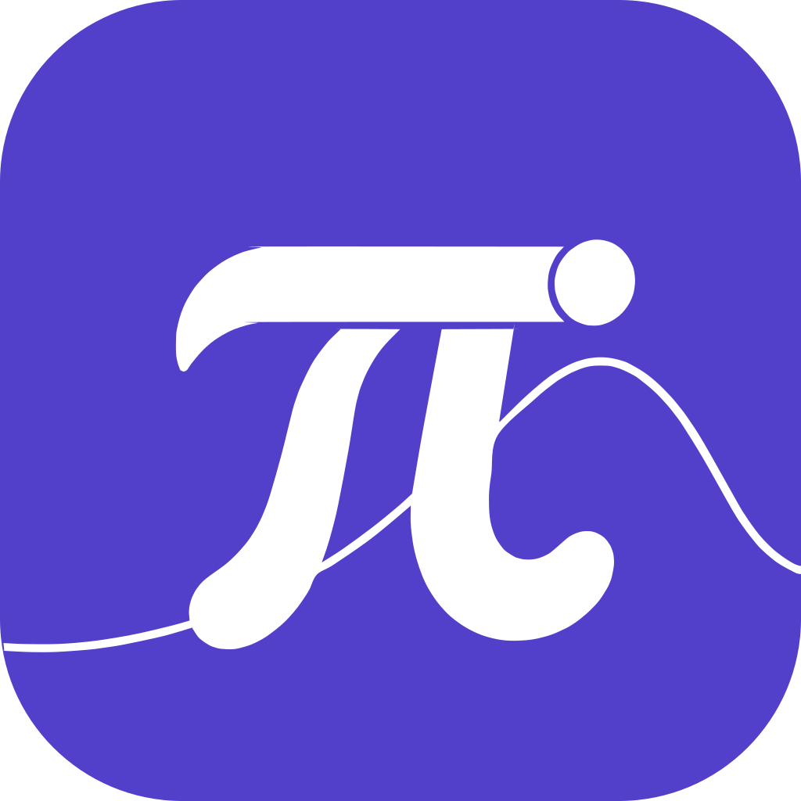
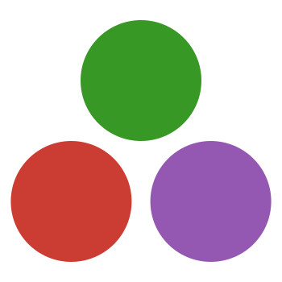
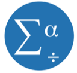
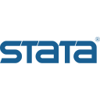
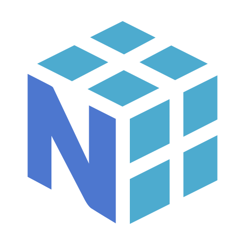
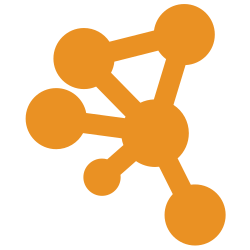
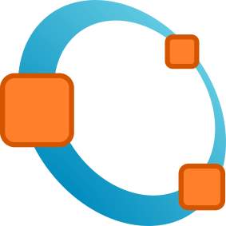
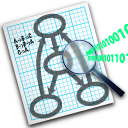
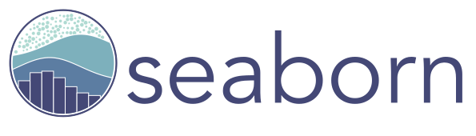

  

<h1 align="center"></h1>

<strong>科学計算と統計解析のための AI プログラミングアシスタント。</strong>

データを理解し、分析を組み立て、結果を確かめる。

  <a href="https://pize.ai/ja">公式サイト</a> &middot;
  <a href="https://pize.ai/docs">ドキュメント</a> &middot;
  <a href="https://pize.ai/download">ダウンロード</a>

  <a href="README.md">简体中文</a> &middot; <a href="README.en.md">English</a> &middot; <a href="README.de.md">Deutsch</a> &middot; <a href="README.ja.md">日本語</a> &middot; <a href="README.fr.md">Français</a> &middot; <a href="README.ar.md">العربية</a> &middot; <a href="README.es.md">Español</a> &middot; <a href="README.hi.md">हिन्दी</a> &middot; <a href="README.id.md">Bahasa Indonesia</a> &middot; <a href="README.ru.md">Русский</a>

---

##  **科学計算のエコシステム**

<table width="100%" align="center" dir="ltr">
  <tr>
    <td width="10%" align="center" valign="middle">
      
       <a href="https://www.r-project.org/">R</a>
    </td>
    <td width="10%" align="center" valign="middle">
      
       <a href="https://www.python.org/">Python</a>
    </td>
    <td width="10%" align="center" valign="middle">
      
       <a href="https://jupyter.org/">Jupyter</a>
    </td>
    <td width="10%" align="center" valign="middle">
      
       <a href="https://julialang.org/">Julia</a>
    </td>
    <td width="10%" align="center" valign="middle">
      
       <a href="https://posit.co/products/open-source/rstudio">RStudio</a>
    </td>
    <td width="10%" align="center" valign="middle">
      
       <a href="https://www.ibm.com/products/spss-statistics">SPSS</a>
    </td>
    <td width="10%" align="center" valign="middle">
      <a href="https://www.stata.com/">
        <picture>
          <source media="(prefers-color-scheme: dark)" srcset="assets/scientific-logos/stata-dark.svg" width="48" height="14" />
          
        </picture>
      </a>
       <a href="https://www.stata.com/">Stata</a>
    </td>
    <td width="10%" align="center" valign="middle">
      
       <a href="https://www.sas.com/en_us/home.html">SAS</a>
    </td>
    <td width="10%" align="center" valign="middle">
      
       <a href="https://isocpp.org/">C++</a>
    </td>
    <td width="10%" align="center" valign="middle">
      
       <a href="https://quarto.org/">Quarto</a>
    </td>
  </tr>
  <tr>
    <td width="10%" align="center" valign="middle">
      
       <a href="https://numpy.org/">NumPy</a>
    </td>
    <td width="10%" align="center" valign="middle">
      
       <a href="https://pandas.pydata.org/">pandas</a>
    </td>
    <td width="10%" align="center" valign="middle">
      
       <a href="https://scipy.org/">SciPy</a>
    </td>
    <td width="10%" align="center" valign="middle">
      
       <a href="https://scikit-learn.org/stable/">scikit-learn</a>
    </td>
    <td width="10%" align="center" valign="middle">
      
       <a href="https://pytorch.org/">PyTorch</a>
    </td>
    <td width="10%" align="center" valign="middle">
      
       <a href="https://www.tensorflow.org/">TensorFlow</a>
    </td>
    <td width="10%" align="center" valign="middle">
      <a href="https://plotly.com/">
        <picture>
          <source media="(prefers-color-scheme: dark)" srcset="assets/scientific-logos/plotly-dark.svg" width="48" height="16" />
          
        </picture>
      </a>
       <a href="https://plotly.com/">Plotly</a>
    </td>
    <td width="10%" align="center" valign="middle">
      
       <a href="https://imagej.net/">ImageJ</a>
    </td>
    <td width="10%" align="center" valign="middle">
      
       <a href="https://www.graphpad.com/features">GraphPad Prism</a>
    </td>
    <td width="10%" align="center" valign="middle">
      
       <a href="https://www.ncss.com/">NCSS</a>
    </td>
  </tr>
  <tr>
    <td width="10%" align="center" valign="middle">
      
       <a href="https://cytoscape.org/">Cytoscape</a>
    </td>
    <td width="10%" align="center" valign="middle">
      
       <a href="https://octave.org/">GNU Octave</a>
    </td>
    <td width="10%" align="center" valign="middle">
      
       <a href="https://graphviz.org/">Graphviz</a>
    </td>
    <td width="10%" align="center" valign="middle">
      
       <a href="https://imagej.net/software/fiji/">Fiji</a>
    </td>
    <td width="10%" align="center" valign="middle">
      
       <a href="https://www.mathworks.com/products/matlab.html">MATLAB</a>
    </td>
    <td width="10%" align="center" valign="middle">
      <a href="https://matplotlib.org/">
        <picture>
          <source media="(prefers-color-scheme: dark)" srcset="assets/scientific-logos/matplotlib-dark.svg" width="48" height="11" />
          
        </picture>
      </a>
       <a href="https://matplotlib.org/">Matplotlib</a>
    </td>
    <td width="10%" align="center" valign="middle">
      
       <a href="https://ggplot2.tidyverse.org/">ggplot2</a>
    </td>
    <td width="10%" align="center" valign="middle">
      
       <a href="https://seaborn.pydata.org/">Seaborn</a>
    </td>
    <td width="10%" align="center" valign="middle">
      
       <a href="https://www.paraview.org/">ParaView</a>
    </td>
    <td width="10%" align="center" valign="middle">
      
       <a href="https://www.blender.org/">Blender</a>
    </td>
  </tr>
</table>

Pize は、データ分析、数値計算、機械学習、可視化で使われるさまざまな研究用言語やツールに対応しています。こうした研究ワークフローを AI によるプログラミング支援でサポートしており、具体的な対応範囲は[公式ドキュメント](https://pize.ai/docs)に記載しています。

##  **コード補完から作成・不具合の確認まで、研究のためのプログラミング支援**

**Pize は、科学技術コードと統計データを扱うための AI プログラミングアシスタントです。** プロジェクトの理解から分析計画、コードの作成・実行、出力やグラフの確認、その後の見直しまで、一連の作業を支援します。Pize Code、Positron、CLI で利用でき、SDK を使って自分のプログラムに組み込むこともできます。

分析の誤りは、モデルを作る前の段階で生じることも少なくありません。区切り文字の誤認、欠損値を数値として扱うこと、最初の観測行をヘッダーと取り違えることなどが、その例です。Pize はまずデータを理解することを重視し、ファイルの中身を推測するのではなく、入力の実際の構造に基づいてコードを書く作業を支えます。

このリポジトリは Pize の製品紹介とコミュニティのための公開ページです。創設者の [@guopengnaivoc](https://github.com/guopengnaivoc) が管理しています。

##  **Pize ができること**

| 機能 | できること |
| --- | --- |
| **データファイルの理解** | 内容から区切り文字、ヘッダー、欠損値、列の型を判別し、コメント、メタデータ、圧縮された表形式データを扱います。 |
| **大規模データのコンテキストを整理** | ファイルがコンテキストの上限を超える場合は、表全体を会話に渡す代わりに、構造、少量のプレビュー、推定と明記した行数を含む簡潔なデータカードを提供します。 |
| **実際の R / Python セッションに接続** | Positron で現在のセッションを確認し、データフレームを要約します。承認後にコードを実行してグラフを取得し、実際の出力を踏まえて作業を進められます。 |
| **コード変更のレビュー** | 複数ファイルにまたがる変更を調整し、差分の確認、変更の取り消し、以前のタスクチェックポイントへの復帰を行えます。 |
| **計画してから実行** | 先にプロジェクトを理解して分析方針を相談し、承認を得てからコードの作成やターミナルコマンドの実行に進みます。 |
| **プロジェクトとブラウザーの情報を活用** | ファイル、フォルダー、問題、URL を参照できます。デバッグではブラウザー操作、スクリーンショット、ログを組み合わせて問題を調べます。 |
| **プロジェクトの規約を再利用** | プロジェクトルールやスキルを使い、統計上の定義、作図の規約、ディレクトリ構成を整理します。 |

Parquet、Arrow、RDS、HDF5、h5ad、NumPy、SPSS、Stata などの研究用データ形式については、形式の識別と、それに合った読み込みコードの作成を支援します。すべてのバイナリ形式を直接会話内のテキストに変換するという意味ではありません。詳しい動作と制約は[データ読み取り・ランタイムのドキュメント](https://pize.ai/docs)をご覧ください。

##  **いつもの環境で使う**

| 利用方法 | 主な用途 |
| --- | --- |
| **Pize Code** | エディターでプロジェクトを理解し、コード変更を確認しながら、ターミナルを使って作業します。 |
| **Positron** | 同じアシスタントを使い、現在フォーカスされている R または Python セッションに接続します。 |
| **CLI** | コマンドラインから Pize を利用します。 |
| **SDK** | プログラミングアシスタントとデータを扱う機能を、自作プログラムや内部ツールに組み込みます。 |

実行中のセッションへのブリッジは Positron 固有の機能であり、どの利用方法でも同じランタイムアクセスが得られるわけではありません。インストール方法と各環境の詳細は[公式ドキュメント](https://pize.ai/docs)をご確認ください。

##  **モデルの選択と外部ツールの接続**

Pize はクラウドモデルとローカルモデルへの接続に対応しています。Anthropic、OpenAI、Google Gemini、DeepSeek、AWS Bedrock、OpenRouter、OpenAI 互換 API を備えたサービスなどから、研究の目的や導入環境に合うモデルと設定を選べます。

**SDK は Pize をプログラムに組み込むためのもの、MCP は Pize を外部ツールにつなぐためのものです。** Pize は MCP クライアントとして、互換サーバーを通じてデータベース、内部システム、研究室のツールに接続できます。実際に使える操作は、接続先サーバーと付与した権限によって変わります。

##  **使い始めるには**

1. **利用環境を選ぶ。** [公式ダウンロードページ](https://pize.ai/download)から、使う環境に合った手順でインストールします。
2. **モデルを設定する。** ドキュメントに従って、対応するモデルサービスまたはローカルの接続先を設定します。
3. **研究のコンテキストを渡す。** プロジェクトを開き、関連するスクリプトやデータを添付します。Positron では、対象データを読み込んだセッションにフォーカスします。
4. **計画・承認・見直しを進める。** まず分析方針を決め、提案された操作を確認します。実行後はコード、出力、グラフを見てから次の手順を判断します。

###  **こんな依頼から始められます**

以下は使い方を示す依頼文の例であり、独立した検証を受けた分析結果ではありません。

- 「分析を提案する前に、このデータセットの列、型、欠損値を確認してください。」
- 「この R または Python の分析手順を説明し、私が確認すべき仮定を挙げてください。」
- 「分析スクリプトの修正を手伝ってください。承認後に実行し、診断プロットを使って結果を説明してください。」

Pize は作業を支援しますが、科学的判断の代わりにはなりません。分析結果を利用する前に、手法の前提と出力を確認してください。データの扱いは設定したツールやモデルサービスに依存するため、製品の[プライバシー情報](https://pize.ai/privacy)とモデル提供元の方針もお読みください。

##  **このリポジトリの公開範囲**

このリポジトリでは、製品紹介、コミュニティ向けの案内、独立した[タンパク質のインタラクティブ表示ページ](https://guopengnaivoc.github.io/pize.ai/)を公開しています。表示ページは視覚的なデモであり、タンパク質予測サービスでも、検証済みの研究成果を示すものでもありません。データの出典は[タンパク質素材のクレジット](assets/protein-CREDITS.md)に記載しています。

**Pize のコアアプリケーションのソースコードは、このリポジトリでは公開していません。** 表示ページの公開は、製品全体のオープンソース化を意味しません。今後、一部のツール、サンプル、技術ノートを、公開範囲とライセンスを明記したうえで個別に公開する場合があります。ソフトウェアの入手方法と現在の提供状況は公式サイトをご確認ください。

##  **創設者・フィードバック・協力のご案内**

Pize は [@guopengnaivoc](https://github.com/guopengnaivoc) が創設・管理し、**pize.ai** のブランド名で展開しています。公式サイトが製品の入口となり、このリポジトリではプロジェクトの紹介、コミュニティ資料の管理、フィードバックの受け付けを行います。

- **製品への質問・機能の要望：** [GitHub Issue](https://github.com/guopengnaivoc/pize.ai/issues) を作成してください。
- **不具合の報告：** 環境、具体的な作業、期待した動作、実際の動作を記載し、できれば最小限の再現例も添えてください。詳しくは[参加ガイド](CONTRIBUTING.md)をご覧ください。
- **共同作業、研究室での利用、非公開の相談：** 下記の目的に合うメールアドレスにご連絡ください。

公開 Issue に API キー、アカウントの認証情報、非公開データセット、未発表の研究資料を投稿しないでください。製品機能とインストールの詳細は [pize.ai](https://pize.ai/ja) と[公式ドキュメント](https://pize.ai/docs)をご参照ください。

##  **Pize へのお問い合わせ**

メールアドレスをクリックすると、件名が入力された状態でメールアプリが開きます。以下は[公式お問い合わせページ](https://pize.ai/contact)に掲載されているアドレスです。

| 窓口 | お問い合わせ内容 | メール |
| --- | --- | --- |
| **一般のお問い合わせ** | 製品への質問、取材のご相談、リリース情報。 | [hello@pize.ai](mailto:hello@pize.ai?subject=Pize%20general%20inquiry) |
| **製品に関するご相談** | 製品デモ、導入に関する質問、協力のご相談。 | [contact@pize.ai](mailto:contact@pize.ai?subject=Pize%20product%20inquiry) |
| **技術サポート** | アカウント、ドキュメント、プライバシー、データ削除の依頼。 | [support@pize.ai](mailto:support@pize.ai?subject=Pize%20support%20request) |
| **ビジネス・パートナーシップ** | 購入、研究協力、ビジネスに関するお問い合わせ。 | [business@pize.ai](mailto:business@pize.ai?subject=Pize%20business%20inquiry) |
