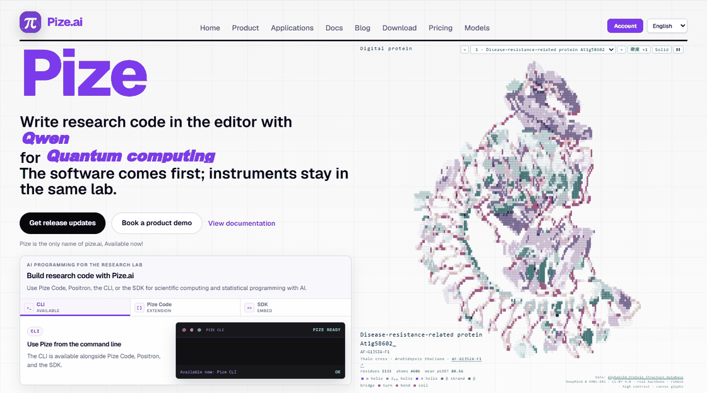
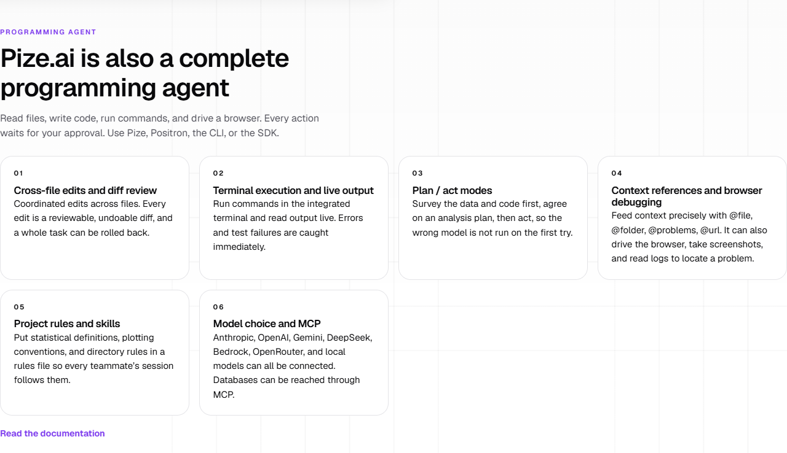
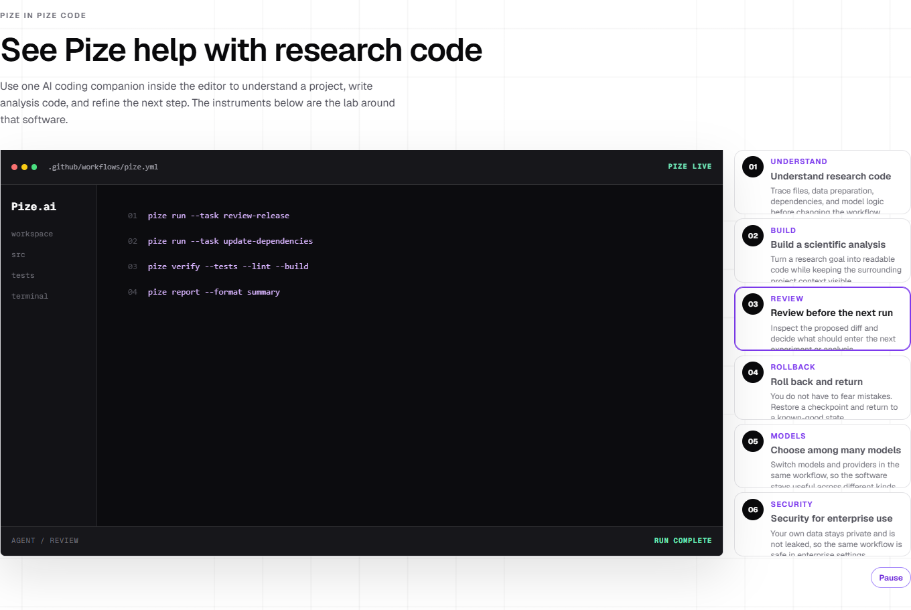

  <a href="https://pize.ai"><strong>Explore Pize</strong></a> &nbsp; / &nbsp;
  <a href="https://pize.ai/docs">Documentation</a> &nbsp; / &nbsp;
  <a href="https://pize.ai/download">Download</a> &nbsp; / &nbsp;
  <a href="README.zh-CN.md">简体中文</a>

 

 

Real website captures. Open any image to explore Pize.

---

Maintained by Pize's founder, [@guopengnaivoc](https://github.com/guopengnaivoc), publishing as **pize.ai**.

<strong>About this repository</strong>

This is Pize's public product and community hub. It contains product information, promotional assets, and community documentation, not the product's core source code. Selected tools, examples, and technical notes may be published separately in the future with their own scope and license.

For current software availability, visit [pize.ai/download](https://pize.ai/download). See the [repository FAQ](docs/FAQ.md) for more information.

<strong>Feedback and contact</strong>

Share product questions and suggestions through [GitHub Issues](https://github.com/guopengnaivoc/pize.ai/issues). For private inquiries and collaboration, [contact Pize](https://pize.ai/contact). Please do not post credentials, private research data, or account details in public issues. Read the [feedback guide](CONTRIBUTING.md).

<strong>Still image and visual credits</strong>

[View the homepage without animation](assets/pize-home.png). The images are captures of [pize.ai](https://pize.ai), not a redesigned mockup. The workflow image shows the website's own demonstration, not a separate application recording. [Capture details and attribution](assets/SOURCES.md).

