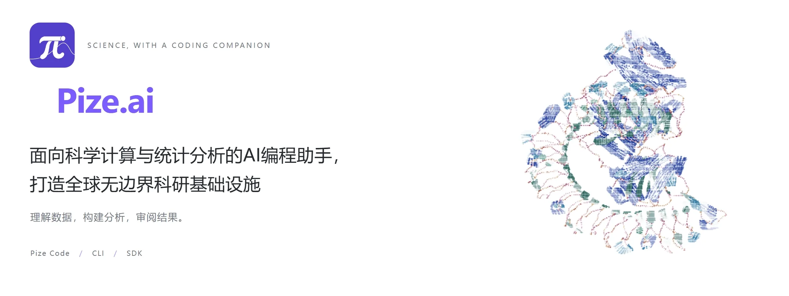

  <a href="https://pize.ai/zh-Hans">
    <picture>
      <source media="(prefers-reduced-motion: reduce) and (prefers-color-scheme: dark)" srcset="assets/hero-v3/hero-dark.png" />
      <source media="(prefers-reduced-motion: reduce)" srcset="assets/hero-v3/hero-light.png" />
      <source media="(prefers-color-scheme: dark)" srcset="assets/hero-v3/hero-dark.webp" />
      
    </picture>
  </a>

  <a href="https://pize.ai/zh-Hans">首页</a> &middot; <a href="https://pize.ai/zh-Hans/product">产品</a> &middot; <a href="https://pize.ai/zh-Hans/applications">科学应用</a> &middot; <a href="https://pize.ai/zh-Hans/docs">文档</a> &middot; <a href="https://pize.ai/zh-Hans/blog">博客</a> &middot; <a href="https://pize.ai/zh-Hans/download">下载</a> &middot; <a href="https://pize.ai/zh-Hans/pricing">定价</a> &middot; <a href="https://pize.ai/zh-Hans/model-scores">模型评分</a>

  <a href="README.md">简体中文</a> &middot; <a href="README.en.md">English</a> &middot; <a href="README.de.md">Deutsch</a> &middot; <a href="README.ja.md">日本語</a> &middot; <a href="README.fr.md">Français</a> &middot; <a href="README.ar.md">العربية</a> &middot; <a href="README.es.md">Español</a> &middot; <a href="README.hi.md">हिन्दी</a> &middot; <a href="README.id.md">Bahasa Indonesia</a> &middot; <a href="README.ru.md">Русский</a>

---

##  **科学计算生态**

<table width="100%" align="center" dir="ltr">
  <tr>
    <td width="10%" align="center" valign="middle">
      
       <a href="https://www.r-project.org/">R</a>
    </td>
    <td width="10%" align="center" valign="middle">
      
       <a href="https://www.python.org/">Python</a>
    </td>
    <td width="10%" align="center" valign="middle">
      
       <a href="https://jupyter.org/">Jupyter</a>
    </td>
    <td width="10%" align="center" valign="middle">
      
       <a href="https://julialang.org/">Julia</a>
    </td>
    <td width="10%" align="center" valign="middle">
      
       <a href="https://posit.co/products/open-source/rstudio">RStudio</a>
    </td>
    <td width="10%" align="center" valign="middle">
      
       <a href="https://www.ibm.com/products/spss-statistics">SPSS</a>
    </td>
    <td width="10%" align="center" valign="middle">
      <a href="https://www.stata.com/">
        <picture>
          <source media="(prefers-color-scheme: dark)" srcset="assets/scientific-logos/stata-dark.svg" width="48" height="14" />
          
        </picture>
      </a>
       <a href="https://www.stata.com/">Stata</a>
    </td>
    <td width="10%" align="center" valign="middle">
      
       <a href="https://www.sas.com/en_us/home.html">SAS</a>
    </td>
    <td width="10%" align="center" valign="middle">
      
       <a href="https://isocpp.org/">C++</a>
    </td>
    <td width="10%" align="center" valign="middle">
      
       <a href="https://quarto.org/">Quarto</a>
    </td>
  </tr>
  <tr>
    <td width="10%" align="center" valign="middle">
      
       <a href="https://numpy.org/">NumPy</a>
    </td>
    <td width="10%" align="center" valign="middle">
      
       <a href="https://pandas.pydata.org/">pandas</a>
    </td>
    <td width="10%" align="center" valign="middle">
      
       <a href="https://scipy.org/">SciPy</a>
    </td>
    <td width="10%" align="center" valign="middle">
      
       <a href="https://scikit-learn.org/stable/">scikit-learn</a>
    </td>
    <td width="10%" align="center" valign="middle">
      
       <a href="https://pytorch.org/">PyTorch</a>
    </td>
    <td width="10%" align="center" valign="middle">
      
       <a href="https://www.tensorflow.org/">TensorFlow</a>
    </td>
    <td width="10%" align="center" valign="middle">
      <a href="https://plotly.com/">
        <picture>
          <source media="(prefers-color-scheme: dark)" srcset="assets/scientific-logos/plotly-dark.svg" width="48" height="16" />
          
        </picture>
      </a>
       <a href="https://plotly.com/">Plotly</a>
    </td>
    <td width="10%" align="center" valign="middle">
      
       <a href="https://imagej.net/">ImageJ</a>
    </td>
    <td width="10%" align="center" valign="middle">
      
       <a href="https://www.graphpad.com/features">GraphPad Prism</a>
    </td>
    <td width="10%" align="center" valign="middle">
      
       <a href="https://www.ncss.com/">NCSS</a>
    </td>
  </tr>
  <tr>
    <td width="10%" align="center" valign="middle">
      
       <a href="https://cytoscape.org/">Cytoscape</a>
    </td>
    <td width="10%" align="center" valign="middle">
      
       <a href="https://octave.org/">GNU Octave</a>
    </td>
    <td width="10%" align="center" valign="middle">
      
       <a href="https://graphviz.org/">Graphviz</a>
    </td>
    <td width="10%" align="center" valign="middle">
      
       <a href="https://imagej.net/software/fiji/">Fiji</a>
    </td>
    <td width="10%" align="center" valign="middle">
      
       <a href="https://www.mathworks.com/products/matlab.html">MATLAB</a>
    </td>
    <td width="10%" align="center" valign="middle">
      <a href="https://matplotlib.org/">
        <picture>
          <source media="(prefers-color-scheme: dark)" srcset="assets/scientific-logos/matplotlib-dark.svg" width="48" height="11" />
          
        </picture>
      </a>
       <a href="https://matplotlib.org/">Matplotlib</a>
    </td>
    <td width="10%" align="center" valign="middle">
      
       <a href="https://ggplot2.tidyverse.org/">ggplot2</a>
    </td>
    <td width="10%" align="center" valign="middle">
      
       <a href="https://seaborn.pydata.org/">Seaborn</a>
    </td>
    <td width="10%" align="center" valign="middle">
      
       <a href="https://www.paraview.org/">ParaView</a>
    </td>
    <td width="10%" align="center" valign="middle">
      
       <a href="https://www.blender.org/">Blender</a>
    </td>
  </tr>
</table>

兼容适配多种科研统计与计算语言与工具生态，涵盖数据分析、数值计算、机器学习和可视化。Pize 面向这些科研工作流提供 AI 辅助编程辅助，具体支持范围以[官方文档](https://pize.ai/docs)为准。

##  **围绕科研工作，而不只是补全代码，还能帮您创建代码，并进行bug审查**

**Pize 是为科学代码和统计数据工作设计的 AI 编程助手。** 从理解项目、准备分析方案，到编写和运行代码、查看输出与图表，再到调整下一步，Pize 将这些工作连接起来。你可以在 Pize Code、命令行 CLI 中使用，也可以通过 SDK 集成到自己的程序中。

科研分析中的错误，往往在建模之前就已发生：分隔符识别错误、缺失值被当作数字、第一行观测值被误认为表头。Pize 把理解数据放在前面，让后续编程基于输入的真实结构，而不是对文件内容的猜测。

这里是 Pize 的公开产品与社区主页。

##  **Pize 能做什么**

| 核心能力 | 对应的工作方式 |
| --- | --- |
| **理解数据文件** | 根据内容识别分隔符、表头、缺失值和各列类型，处理注释、元数据以及压缩表格。 |
| **为大数据提供精简上下文** | 文件超出上下文预算时，提供包含结构、小量预览和明确标注的估算行数的数据卡，而不是把整张表塞进对话。 |
| **可审阅的代码修改** | 协调多个文件的改动，查看差异、撤销修改，并回到此前的任务检查点。 |
| **先规划，再执行** | 先了解项目并讨论分析方案，再经批准编写代码、运行终端命令。 |
| **项目与浏览器上下文** | 引用文件、文件夹、问题和网址；需要调试时，结合浏览器操作、截图和日志定位问题。 |
| **复用项目规范** | 通过项目规则与技能，组织统计定义、绘图约定和目录规范。 |

对于 Parquet、Arrow、RDS、HDF5、h5ad、NumPy、SPSS、Stata 等科研数据容器，Pize 可以识别格式并引导生成相应的读取代码。这不等于将所有二进制格式直接解码为对话内容。具体行为与边界见[数据读取和运行时文档](https://pize.ai/docs)。

##  **在你习惯的环境中使用**

| 使用方式 | 适用场景 |
| --- | --- |
| **Pize Code** | 在编辑器中理解项目、审阅代码修改，并完成终端工作流。 |
| **CLI** | 从命令行使用 Pize。 |
| **SDK** | 将编程助手及其面向数据的能力嵌入自己的程序或内部工具。 |

不同使用入口的运行时访问能力可能不同，安装与各入口的具体说明以[官方文档](https://pize.ai/docs)为准。

##  **模型选择与工具连接**

Pize 支持云端与本地模型连接，包括 Anthropic、OpenAI、Google Gemini、DeepSeek、AWS Bedrock、OpenRouter，以及兼容 OpenAI 接口的服务。你可以按研究需求和部署环境选择模型与配置。

**SDK 负责把 Pize 嵌入你的程序，MCP 负责让 Pize 连接外部工具。** Pize 作为 MCP 客户端，可以通过兼容的服务器连接数据库、内部系统和实验室工具。实际可用操作取决于所连接的服务器以及你授予的权限。

##  **开始使用**

1. **选择使用环境。** 从[官方下载页](https://pize.ai/download)开始，按照文档完成对应环境的安装。
2. **配置模型。** 根据文档连接支持的模型服务或本地接口。
3. **提供科研上下文。** 打开项目，附上相关脚本或数据，并说明分析目标与运行环境。
4. **规划、批准、迭代。** 先确定分析思路，再审阅操作；运行后检查代码、输出和图表，然后决定下一步。

###  **可以从这些研究问题开始**

以下是使用提示示例，不是已经过独立验证的分析结果。

- “先检查这个数据集的列、类型和缺失值，再提出分析建议。”
- “解释这段 R 或 Python 分析流程，列出需要我审阅的假设。”
- “帮我修改分析脚本，在批准后运行，并结合诊断图解释结果。”

Pize 辅助工作流程，但不能代替科研判断。依赖分析结果之前，请审阅方法假设与输出。数据处理方式与所配置的工具和模型服务有关，请同时阅读产品的[隐私说明](https://pize.ai/privacy)及模型提供方政策。

##  **这个仓库公开什么**

本仓库提供产品介绍、社区说明，以及独立的[蛋白质交互展示页](https://guopengnaivoc.github.io/pize.ai/)。展示页是视觉演示，不是蛋白质预测服务，也不代表经过验证的科研结果；数据来源见[蛋白质素材说明](assets/protein-CREDITS.md)；首屏动画的来源与制作说明见[首屏素材署名](assets/hero-v3/CREDITS.md)。

**Pize 核心应用源码未在本仓库公开。** 展示页的公开不代表完整产品开源。未来可以单独发布部分工具、示例和技术笔记，并分别说明公开范围与许可。软件获取方式和当前可用性以官网为准。

##  **创始人、反馈与合作**

Pize 由 [@guopengnaivoc](https://github.com/guopengnaivoc) 创立，对外使用 **pize.ai** 品牌。官网是产品入口，这个仓库用于公开项目介绍、维护社区资料并收集反馈。

- **产品问题与功能建议：** 提交 [GitHub Issue](https://github.com/guopengnaivoc/pize.ai/issues)。
- **报告问题：** 说明使用环境、具体任务、预期行为、实际行为，并尽量提供最小示例，详见[参与指南](CONTRIBUTING.md)。
- **合作、实验室使用或私密咨询：** 通过下方对应的邮箱联系。

请勿在公开 Issue 中上传 API 密钥、账号凭据、私有数据集或未公开研究资料。产品功能与安装细节以 [pize.ai](https://pize.ai) 和[官方文档](https://pize.ai/docs)为准。

##  **联系 Pize**

点击邮箱即可打开邮件应用，并预填对应的邮件主题。以下地址来自[官网联系页](https://pize.ai/contact)。

| 联系类别 | 适用事项 | 邮箱 |
| --- | --- | --- |
| **一般咨询** | 产品问题、媒体咨询与版本更新信息。 | [hello@pize.ai](mailto:hello@pize.ai?subject=Pize%20general%20inquiry) |
| **产品联系** | 产品演示、实施问题与合作沟通。 | [contact@pize.ai](mailto:contact@pize.ai?subject=Pize%20product%20inquiry) |
| **技术支持** | 账号、文档、隐私与数据删除请求。 | [support@pize.ai](mailto:support@pize.ai?subject=Pize%20support%20request) |
| **商务合作** | 采购、科研合作与商业咨询。 | [business@pize.ai](mailto:business@pize.ai?subject=Pize%20business%20inquiry) |
