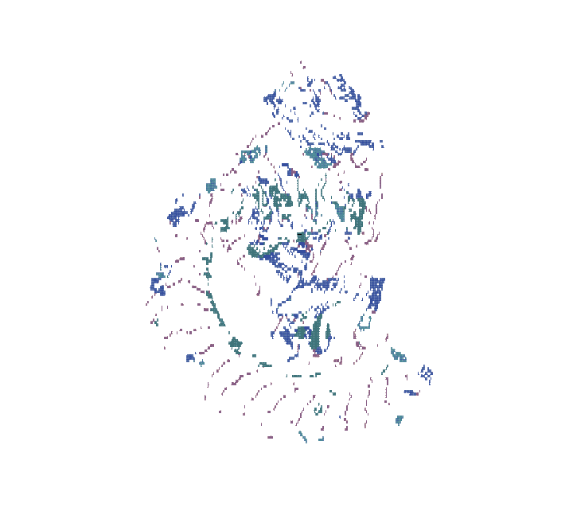

  <a href="https://pize.ai" title="Protein data: AlphaFold Protein Structure Database, DeepMind and EMBL-EBI. CC BY 4.0.">
    <picture>
      <source media="(prefers-color-scheme: dark)" srcset="assets/protein-dark.gif" />
      
    </picture>
  </a>

<!-- Recording and data attribution: assets/protein-CREDITS.md -->
